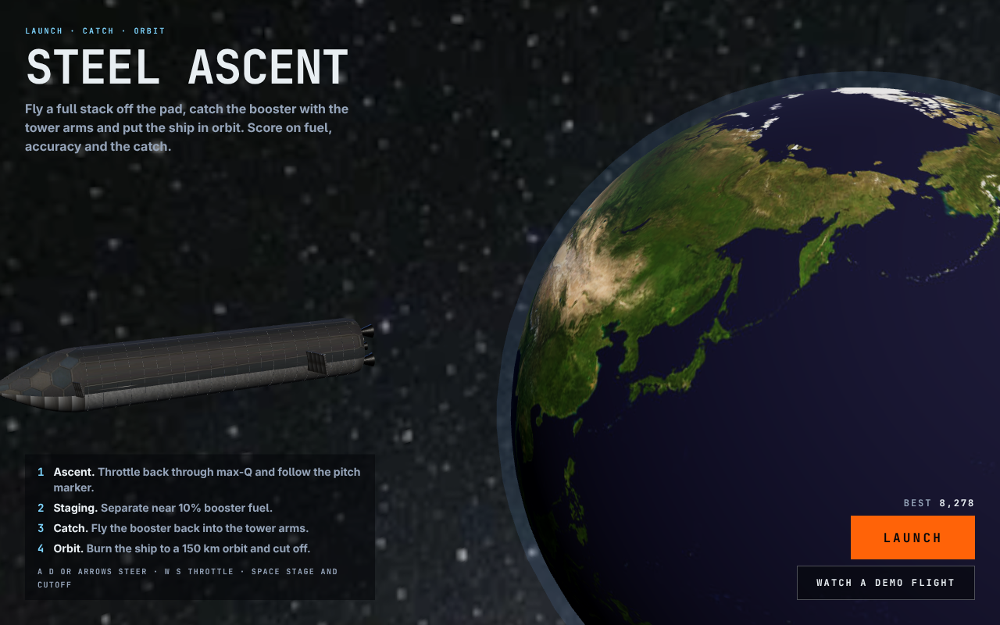
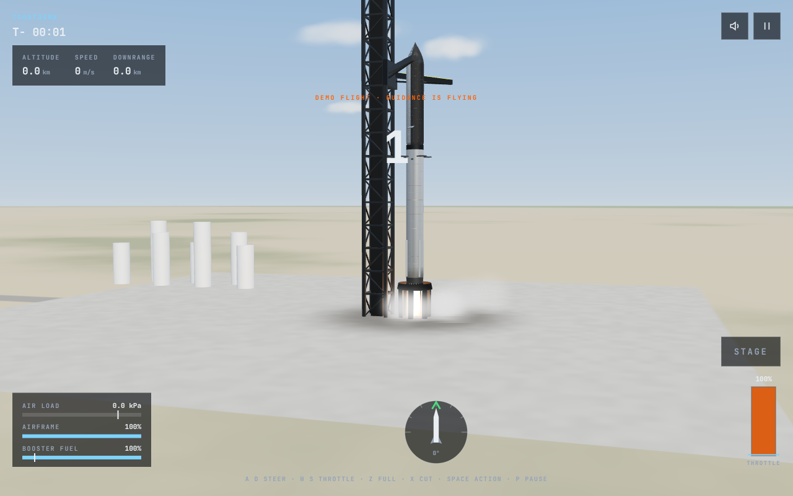
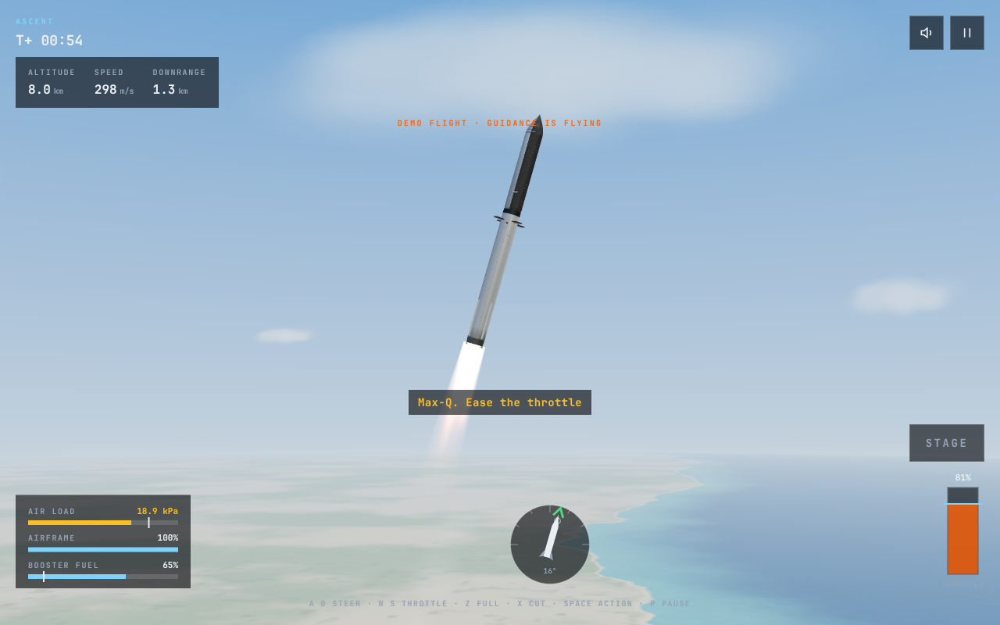
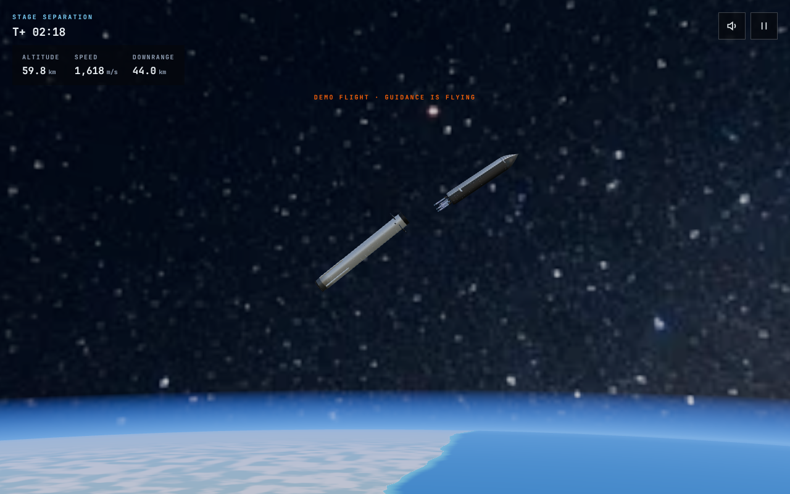
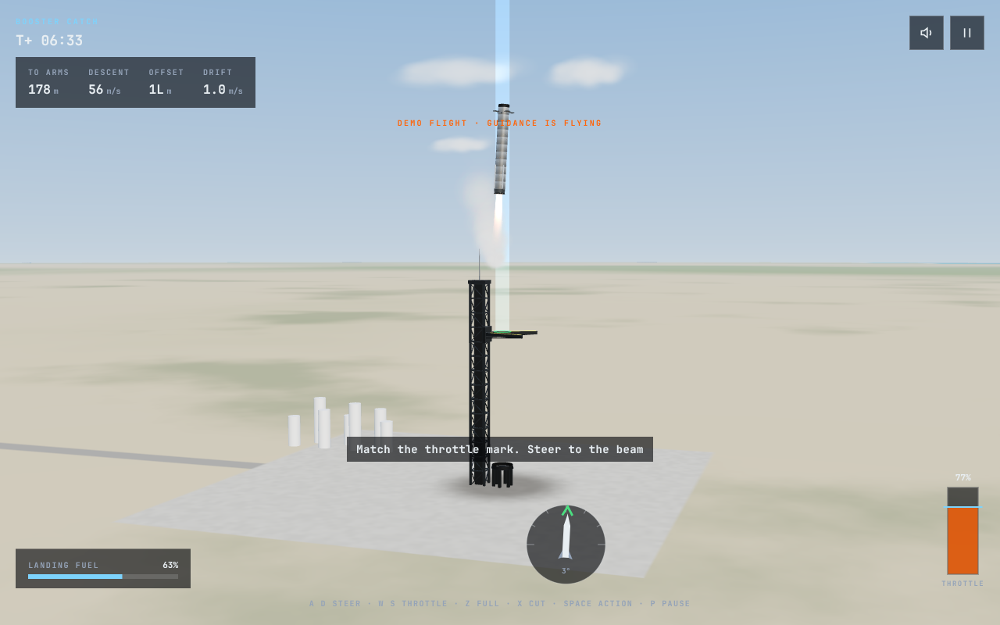
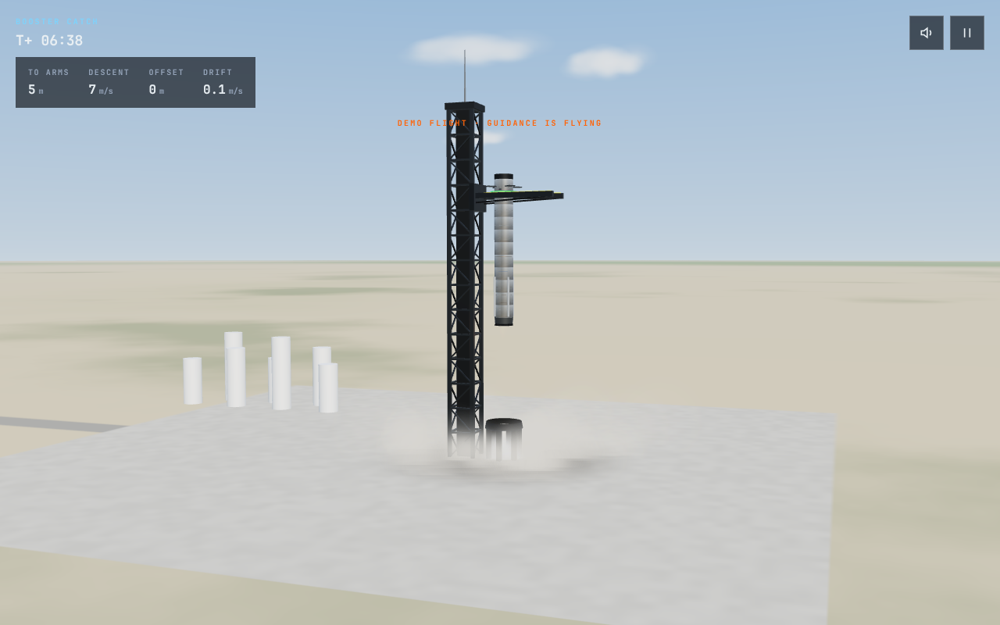
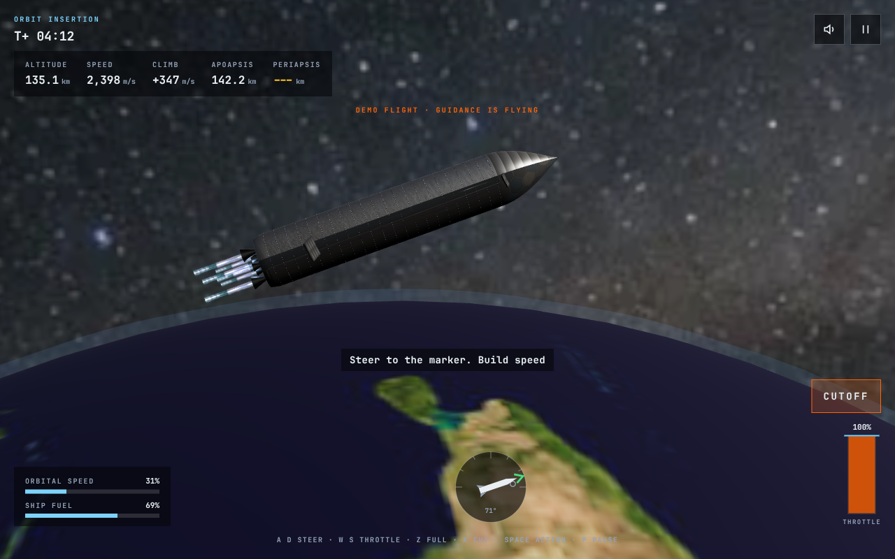
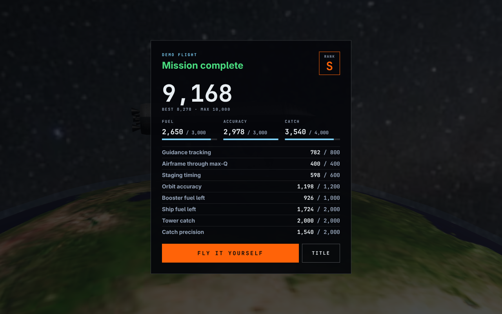
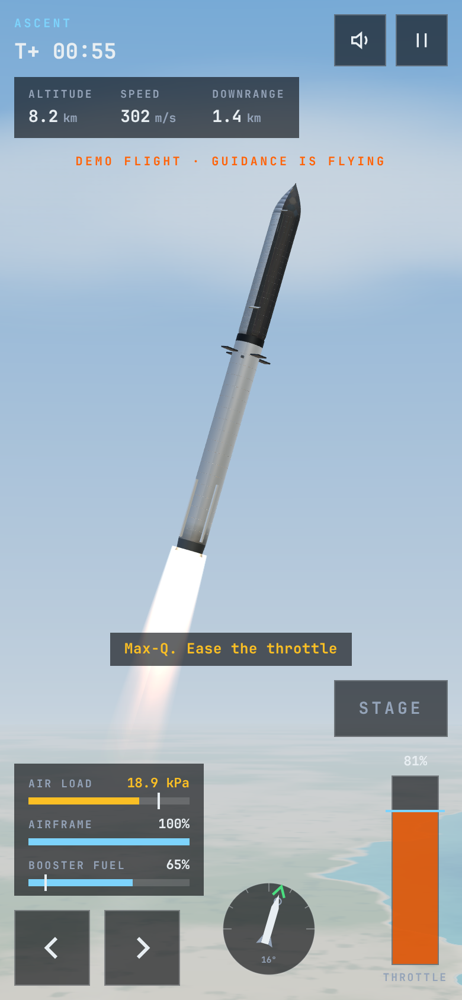

# Starship Simulator

Unofficial fan game. Not affiliated with any launch company.

Fly a two-stage steel rocket from the pad to orbit. Throttle back through max-Q, stage at the right moment, fly the booster back into the tower arms, then burn the ship to a 150 km orbit. You're scored on fuel, accuracy and the catch.

Runs in the browser, on desktop and phone. You don't need to log in, and there's no backend and no API keys.



## The flight

1. **Ascent.** Follow the pitch marker. Ease the throttle when the air load climbs, or the airframe tears apart.
2. **Staging.** The window opens at 25% booster fuel. The best score comes near 10%. Any fuel you save becomes landing fuel.
3. **Catch.** The booster comes back through a crosswind. Light the engines in time, hold the target descent speed, then steer into the green ring between the arms, slow and upright.
4. **Orbit.** Follow the marker to build speed, then cut the engines when the orbit closes. Time slows down near cutoff so the call is fair.

Losing the booster doesn't end the run. The ship still flies to orbit.

## Controls

| Action | Keyboard | Touch |
|---|---|---|
| Steer | A / D or ← / → | Arrow buttons |
| Throttle | W / S or ↑ / ↓ | Drag the throttle bar |
| Full / cut throttle | Z / X | Drag to top / bottom |
| Stage, cutoff, start | Space or Enter | Action button |
| Pause | P or Esc | Pause button |
| Mute | M | Speaker button |

On the attitude dial, the white needle is the vehicle and the chevron is the guidance cue: green means on target. The blue tick on the throttle bar suggests a setting until you pass max-Q. After that the throttle is up to you.

To watch guidance fly a full mission, use **Watch a demo flight** on the title screen, or open `?demo=1`.

## Scoring

The maximum is 10,000:

- **Fuel (3,000):** booster landing fuel left, plus ship fuel left in orbit
- **Accuracy (3,000):** guidance tracking, airframe health through max-Q, staging timing, closeness to a circular 150 km orbit
- **Catch (4,000):** 2,000 for a catch, plus up to 2,000 for how centered, slow and upright it was

Ranks run S, A, B, C, D, F. A clean first flight can reach A. Guidance flying alone lands around 8,800, so S (9,100) means beating it. Your best score is saved in the browser.

## Run

```bash
bun install        # or npm install
bun run dev        # http://127.0.0.1:5173/
bun run test       # game logic unit tests
bun run build      # static site in dist/
```

`dist/` uses relative paths, so it works from any host or sub-path.

`scripts/play-browser.mjs` replays a demo flight in a browser through [agent-browser](https://github.com/vercel-labs/agent-browser) and saves screenshots.

## Screenshots

| | |
|---|---|
|  |  |
|  |  |
|  |  |
|  |  |

## How it's built

- **Stack:** React 19, Vite, TypeScript, Three.js through React Three Fiber, and Tailwind v4.
- **`src/game/`:** pure flight model and scoring, with no rendering code:
  - Ascent: drag, dynamic pressure, and structural damage from air load and angle of attack.
  - Booster catch: landing burn, crosswind and catch tolerances.
  - Ship burn: two-body orbit elements.
  - Unit tests run every phase with the same guidance the demo uses.
- **`src/view/`:** one scene per phase.
  - Sky, ground and haze are drawn with shaders.
  - The tower, booster, exhaust and smoke are generated in code.
  - The ship and Earth reuse the original orbital viewer.
- **`src/audio/`:** all sound is synthesized with WebAudio, with no sample files.
- **`public/assets/`:** textures are listed in [docs/ASSETS.md](docs/ASSETS.md).

## License

MIT. See [LICENSE](LICENSE).
